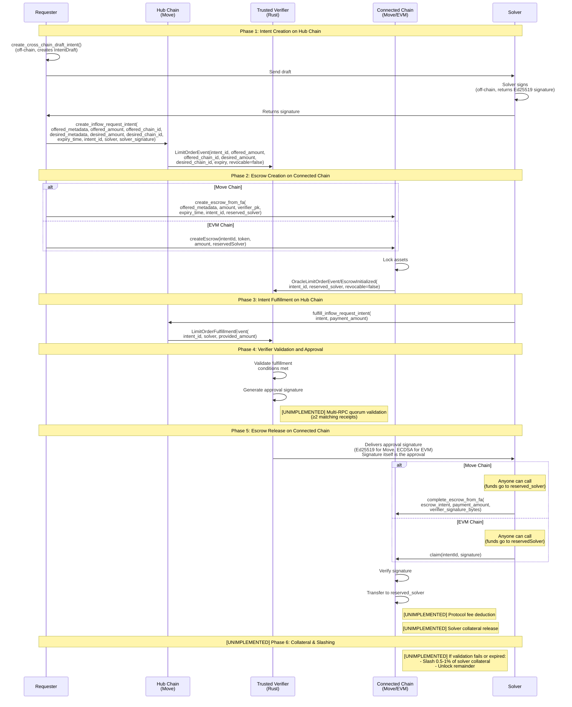
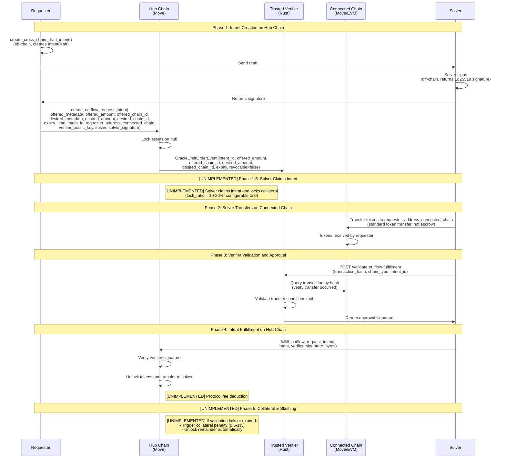
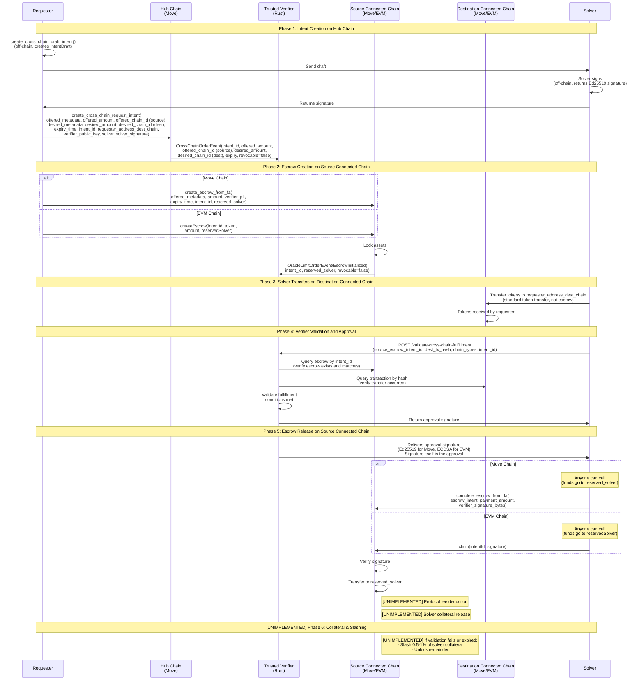

# Architecture Differences

**Note**: This document highlights the differences between the conception documents (conception_generic.md, conception_inflow.md, conception_outflow.md, conception_routerflow.md) and the current implementation. It describes what has been implemented, what differs from the conceptual design, and what is planned for the future.

## System Overview

The system follows a modular architecture with clear separation between on-chain smart contract logic and off-chain verification services. For detailed component organization and domain boundaries, see [Component-to-Domain Mapping](../architecture-component-mapping.md) and [Domain Boundaries and Interfaces](../domain-boundaries-and-interfaces.md).

### Cross-Chain Architecture

For cross-chain scenarios, the system operates with a hub-and-spoke model:

- **Hub Chain**: Hosts intent creation and final settlement
- **Connected Chains**: Host escrow deposits and conditional resource locking
- **Trusted Verifier**: Acts as a bridge service monitoring both hub and connected chains, validating cross-chain conditions, and providing cryptographic proofs

The verifier ensures that escrow operations on connected chains match the intent requirements on the hub chain before providing approval signatures.

#### Cross-Chain Flows

The cross-chain intent protocol supports three primary flows: **Inflow** (Connected Chain → Hub), **Outflow** (Hub → Connected Chain), and **Connected → Connected** (Connected Chain → Connected Chain). These flows enable smooth "deposit → instant credit" UX while maintaining system security through solver collateral and partial slashing mechanisms.

##### Inflow (Connected Chain → Movement)

This flow enables users to deposit offered tokens on a connected chain and receive desired tokens on Movement (hub chain).

**Implementation Details**: See [Inflow Flow Steps](../../docs/protocol.md#inflow-flow-steps) in `protocol.md` for the complete implemented flow.

**Future Enhancements (NOT YET IMPLEMENTED)**:

- **Multi-RPC Quorum**: Verifier uses multiple RPC endpoints with quorum validation (≥2 matching receipts) for enhanced security
- **Protocol Fees**: Automatic fee deduction from escrow transfers to solver
- **Solver Collateral**: Solvers lock collateral that can be slashed (0.5-1%) if validation fails or intent expires
- **Bypass/Verifier-Gated Modes**: Alternative flow modes where verifier commits transactions on behalf of users

##### Outflow (Movement → Connected Chain)

This flow enables users to lock offered tokens on Movement (hub chain) and receive desired tokens on a connected chain.

**Implementation Details**: See [Outflow Flow Steps](../../docs/protocol.md#outflow-flow-steps) in `protocol.md` for the complete implemented flow.

**Future Enhancements (NOT YET IMPLEMENTED)**:

- **Solver Claims Intent**: Solver claims the intent, locking a portion of its long-term collateral (`lock_ratio ≈ 10-20%`, configurable to 0)
- **Protocol Fees**: Automatic fee deduction from hub token transfers to solver
- **Collateral Penalty**: If validation fails or intent expires, trigger collateral penalty (0.5-1%) and unlock remainder
- **Bypass/Verifier-Gated Modes**: Alternative flow modes where verifier commits transactions on behalf of users

##### Connected → Connected (Connected Chain → Connected Chain)

This flow enables users to transfer tokens from one connected chain to another connected chain, with tokens locked on the source connected chain and desired on the destination connected chain.

**Implementation Details**: This flow combines elements of both inflow and outflow:

- **Hub request-intent**: Similar to both inflow and outflow, creates a cross-chain intent on the hub chain
- **Source connected chain escrow-intent**: Like inflow, tokens are locked in escrow on the source connected chain
- **Destination connected chain fulfill transaction**: Like outflow, solver transfers tokens directly on the destination connected chain

**Future Enhancements (NOT YET IMPLEMENTED)**:

- **Multi-RPC Quorum**: Verifier uses multiple RPC endpoints with quorum validation (≥2 matching receipts) for enhanced security
- **Protocol Fees**: Automatic fee deduction from escrow transfers to solver
- **Solver Collateral**: Solvers lock collateral that can be slashed (0.5-1%) if validation fails or intent expires
- **Bypass/Verifier-Gated Modes**: Alternative flow modes where verifier commits transactions on behalf of users

### Architectural Principles

For detailed architectural principles and design philosophy, see the [Architecture Documentation](../README.md):

- **[RPG Methodology Principles](../rpg-methodology.md)** - Design philosophy and domain-based organization principles
- **[Component-to-Domain Mapping](../architecture-component-mapping.md)** - How components are organized into domains and inter-domain interaction patterns
- **[Domain Boundaries and Interfaces](../domain-boundaries-and-interfaces.md)** - Precise domain boundary definitions and interface specifications
