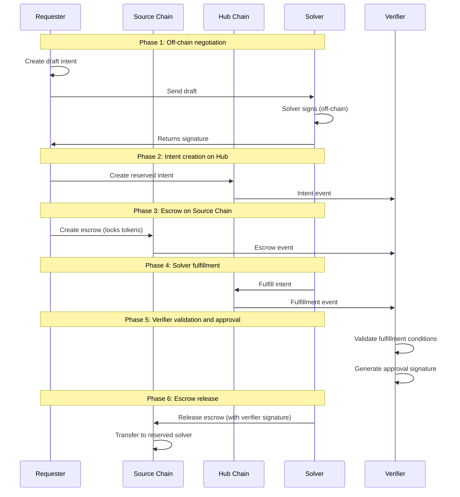

# Conception - Inflow Flow

This document describes the Inflow flow (Connected Chain → Hub). For general concepts, actors, and terminology, see [conception_generic.md](conception_generic.md).

## Use cases

For general use cases applicable to all flows, see [conception_generic.md](conception_generic.md). This section focuses on inflow-specific use cases.

### Users (Requester)

- As a requester, I want to swap some USDC from a connected chain to M1 chain so that I get my USDC on M1 chain fast and with low fee.

## Protocol

**Note**: This describes the Inflow flow (Connected Chain → Hub). For all three flow types (Inflow, Outflow, Connected → Connected), see [requirements.md](requirements.md). For differences between this conception and the current implementation, see [requirements.md](requirements.md).

## Scenarios

### A Requester makes a swap from connected chain to M1 chain

- Given the requester owns the USDC that they want to transfer
- Given the requester owns some Move to execute Tx on M1 chain
- Given the requester owns some connected chain tokens
- Given the requester can access the connected chain and M1 chain RPC

- When the requester wants to realize a swap from connected chain to M1 chain
- then the requester sends a Tx to connected chain to transfer the needed USDC + total fees token to an escrow. ( 1) Requester deposit protocol step)
- then the requester sends a request-intent Tx to the M1 chain. ( 2) Requester initiates intent protocol step)
- then the requester waits for a confirmation of the swap
- then the requester has received the requested amount of USDC in their M1 chain account.

#### Possible issues

1. The requester initial transfer is too little or too much.
The requester didn't get the right expected amount.

Mitigations in the protocol:

1. the contract that creates the intent verifies that the escrow transfer amount is the same as the intent.

#### Question

Are the fees in USDC or in the chain token?

### The Solver resolves an Inflow intent (Connected Chain → Hub)

- Given the solver is registered in the solver registry on Hub chain
- Given the solver owns some Move to execute Tx on M1 chain
- Given the solver owns some connected chain tokens
- Given the solver owns enough USDC on M1 chain
- Given the solver can access both chains' RPC

- When the requester creates a draft intent and sends it to the solver
- Then the solver signs the draft intent off-chain and returns signature
- When the requester creates the reserved intent on Hub chain
- Then the solver observes the request-intent and escrow events
- Then the solver fulfills the intent on Hub chain (transfers desired tokens to requester)
- Then the solver waits for verifier validation and approval
- Then the solver claims the escrow funds on the connected chain

#### Solver flow issues

The solver doesn't send the right amount of desired tokens to the requester on Hub chain.
The solver doesn't receive the correct amount from escrow on connected chain.
The solver is not notified of new intent request events.
The solver attempts to fulfill an intent that wasn't reserved for them (on-chain verification prevents this).

### The adversary steals some funds by doing a swap

- Given the adversary takes the requester role to do a swap

- When the adversary wants to realize a swap from connected chain to M1 chain
- (Optional) Then the adversary sends a Tx to connected chain that transfers too little USDC token to an escrow.
- Then the adversary sends a request-intent Tx to the M1 chain.
- Then the adversary gets more USDC on the M1 chain than they have provided.

Mitigation:
The solver verifies that the needed intent amount (USDC requested amount + fee) has been transferred to the escrow.
How to be sure it's the right transfer Tx?

### The adversary steals some funds by running a solver

- Given the adversary takes the solver role to resolve an intent

- When the adversary is notified of a requester intent request Tx
- Then the adversary reserves the intent
- (Optional) Then the adversary transfers less funds than expected to the requester account.
- The adversary notifies that the intent has been solved.
- Then the adversary waits for the intent amount of USDC to be transferred to the adversary account on the connected chain

### The adversary steals the funds by being a Requester and a Solver

The adversary runs the previous scenario to execute a false intent.

Mitigation:
The process that releases the funds on connected chain verifies that the Requester has transferred the funds (USDC + fee) to the escrow and that the solver has transferred the funds to the requester (USDC).
How to be sure it's the right transfer Txs?

## Protocol steps details

**TODO : TO BE UPDATED**: This describes the Inflow flow (Connected Chain → Hub). The current implementation uses reserved intents (solver signs off-chain before intent creation). Some steps below describe the conceptual unreserved intent flow, which differs from the current implementation. For details on the differences between conception and implementation, see [requirements.md](requirements.md).

### 1) Requester deposit

Requester deposits to the connected chain the amount + fee token to an escrow contract owned by the verifier.
This deposit needs to be tracked by the intent which is why a specific smart contract is used to do it.
The requester calls the smart contract with the amount of token to swap + the pre-calculated fee.
The contract:

- verify the fee amount
- transfer the amount + fee token to the escrow pool
- use a unique `intent_id` (provided by the requester) to associate the escrow with the intent
- save the association with the intent_id and the swap amount in a table.

The intent_id allows to associate the request-intent with a transfer/escrow on the connected chains to verify that the requester has provided the escrow.

Remarks:
If the bridge transfer fails, how can the requester withdraw its tokens?

### 2) Requester initiates intent

**Note**: Current implementation uses reserved intents (solver signs off-chain before intent creation). See [requirements.md](requirements.md) for differences between conception and implementation.

Requester calls the request-intent on the M1 chain. The call creates an unreserved intent (conceptual - current implementation uses reserved intents).

Intent Data:

- requester public keys for both chains: identify the requester on both chains. There's always a M1 chain key in it.
- source chain nonce (conceptual - current implementation uses intent_id): Comes from the initial connected chain transfer done by the requester. Provided as a parameter of the Tx.
- Amount: amount of token to transfer on destination chain. Provided as a parameter of the Tx
- fee: fee of the transfer. Provided as a parameter of the Tx
- source → destination transfer info, for any connected chain to M1 chain transfer defined by the smart contract init, for M1 chain-> connected chain transfer, provided as a parameter of the Tx.
- expiry_time: timestamp where the intent will expire. Added by the contract. If no universal timestamp is available on the chain, provided by the Tx.
- signature of the pub keys (both chains), amount+fee, source→dest, nonce : used to verify the intent is owned by the requester.
- Id (intent_id): Hash of the data without the status: used to identify the intent.
- status: Intent status that can be: Unreserved, Reserved, Filled, Closed. Set to Unreserved when created (conceptual - current implementation creates reserved intents).

Verify that the initial Transfer Tx hash hasn't already been used for another intent. Use the nonce/intent_id to get the amount and save the id of the intent with it.
Verify that the intent amount is the same as the initial transfer Tx.
Save the intent data in a table with the id as key.

### 3) Solver detects unreserved intent

The solver monitors M1 chain event to detect the unreserved intent creation.

**TODO : TO BE UPDATED**: In current implementation, solver signs off-chain before intent creation, so this step happens earlier.

### 4) Solver verifies the intent and the requester's deposit

The solver verifies that the requester has transferred the correct funds to the Verifier's escrow.
The solver verifies that the intent's data are consistent:  signature, Id.

Remarks:
How to be sure the Requester doesn't reuse a Tx already attached to another intent. This verification should be done during the unreserved intent creation.

### 5) Solver lock collaterals

The solver locks in a M1 chain escrow the right amount of collateral to be authorized to reserve the intent. Defined by the lock ratio: Collateral = lock_ratio * amount.

**TODO : TO BE UPDATED**: Solver commitment is ensured through off-chain signature before intent creation, so this step happens earlier.

### 6) Solver lock intent

Solver locks the intent.
Use a first-come, first-served approach to lock the intent to a server to manage concurrent reservations.

**TODO : TO BE UPDATED**: Current implementation reserves intent at creation time based on off-chain solver signature.

### 7) M1 chain verify solver collateral

The M1 chain contract verifies that the solver has enough collateral to fill the request-intent. This verification should take into account all current filled request-intents managed by the solver.
The Solver M1 chain public key is added to the request-intent, and the status changes to reserved.

Steps 5, 6, and 7 are done in the same M1 chain smart contract call.

**Note**: Current implementation verifies solver signature from solver registry at intent creation time, not collateral.

### 8) Solver deposit requester amount on destination chain (= Hub chain)

The solver deposits the amount to the Requester's destination chain account. Can use a specific transfer Tx or a function developed for the intent framework.
The choice will depend on the proof we'll use to determine if the Solver has executed the transfer.

**Note**: In current Inflow flow, solver fulfills the request-intent on Hub chain (which is the destination chain), transferring desired tokens to requester.

### 9) Solver submits intent-filled

The solver submits to the verifier an intent-filled request. This request contains the intent id and the proof of the transfer to the requester.
The Solver submits its account on the connected chain to be able to transfer the funds.

Remarks:
The notification can be done on-chain using the same contract's call as the deposit (Step 8, in this case, the deposit generates an event monitored by the verifier) or call the verifier via a REST entry point.
I'm more in favor of the first behavior (on-chain notification) because it's easier to manage scenarios where notifications are missed. For example, if the  verifier is down, the solver needs to manage to resend the filled request, and this logic can be very error-prone (miss notification error, send several time the same notification, ...).

**TODO : TO BE UPDATED**: Current implementation uses on-chain events for verifier monitoring.

### Solver transfer execution proof

To verify the Solver transfer, the verifier needs a proof.
We can use the transfer Tx as proof, but we need to have a way to validate that the Tx hasn't been executed for another purpose, and in the end, the transfer hasn't been really done. As we can't add extra data to a transfer Tx, we need to use a specific function to do it.

**TODO : TO BE UPDATED**: Current implementation uses on-chain fulfillment transactions that include intent_id in calldata for verification.

In this case, we can develop a function that does the transfer and links it to the intent. So the Solver transfer and the intent filled should be done onchain using a specific function.

So use a direct RPC call to submit the intent filled we need to develop a specific proof generated during the transfer that the solver can use after the tx execution.

**TODO : TO BE UPDATED**: Current implementation uses on-chain fulfillment transactions that include intent_id in calldata for verification.

### 10) Verifier verifies the execution of the filled intent

The verifier verifies that the intent has been executed correctly. The amount has been transferred to the requester. Use the proof of the filled intent.
The verifier verifies that the Requester has transferred its funds to the connected chain. Need if the Requester and solver collude and don't do the initial transfer.

**TODO : TO BE UPDATED**: Current implementation validates fulfillment conditions including amount, recipient, solver match, and transaction success.

### 11) Verifier transfers the solver amount from escrow

The verifier transfers the amount + solver fee to the Solver account.

Deducts fixed protocol fee → Treasury

**TODO : TO BE UPDATED**: Current implementation uses verifier signature approval. Escrow release is done by anyone calling release function with verifier signature.

### 12) Verifier free solver collateral

The verifier releases the locked solver's collateral.

**TODO : TO BE UPDATED**: The fulfillment is already sufficient for inflow intents. So the verifier doesn't need to do anything. However the requester may never submit the escrow - in order to not keep the collateral hostage, a timeout mechanism (tight) should be used. A verifier action is still not needed.

### 13) Verifier closes the intent

The verifier updates the intent status to closed.
Updates exposure metrics.

Steps 11, 12, and 13 are done in the same M1 chain call.

**TODO : TO BE UPDATED**: No need, either it times out or is fulfilled. The intent is closed thus either by timeout or by fulfillment.
