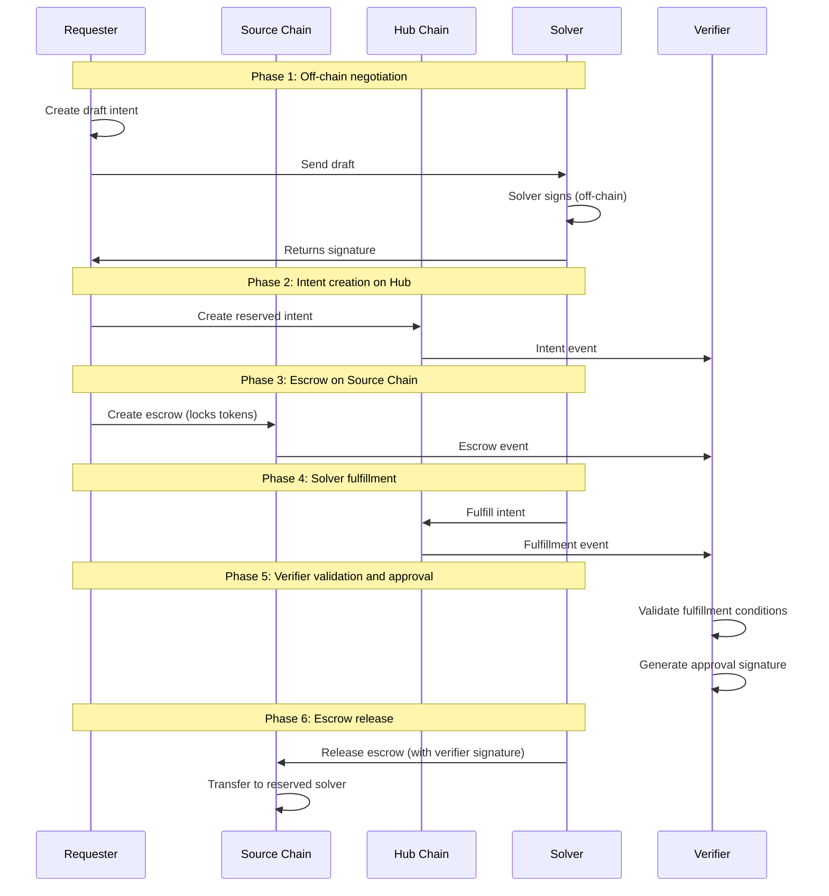

# Conception

## Actor

- User : the user that want to swap some USDC from one chain to another using the intent process. One the the chain is always M1 chain.
- Solver: actor that solve the swap intent. Can be anyone.
- Mvmt: Represent the Mvmt corporation that operate the intent application. Depending on the protocol but it can be a trusted entity if it runs some part of the protocol like the verifier.
- Hacker: a malicious actor that want to steal some fund or disturb the system.

## Use cases

### Users (Requester)

- As a requester, I want to swap some USDC from a chain A to M1 chain so that I get my USDC on M1 chain fast and with low fee.
- As a requester, I want to swap some USDC from M1 chain to a chain so that I get my USDC on the destination chain fast and with low fee.
- As a requester, I want a secure process so that I don't lose any token.

### Solver

- As a solver, I want to gain some token by participating to the intent system so that it exceed my operational cost.
- As a solver, I want a reliable solver process so that I don't have to spend time to operate my servers.
- As a solver, I want to be able to evaluate the benefit of taking an intent so that I don't solve intent that make me lose money.

### Mvmt

- As Mvmt I want to have a reliable and secure application so that Solver and user feel confident to use it.
- As Mvmt I want that User use Move so that it increases the overall M1 chain usage.
- As Mvmt I want to propose an open process where anybody can join so that it can grow without costing more to me.

### Hacker

- As a Hacker I want to steal some funds from the application to earn more money
- As a Hacker I want to disturb the process so that it affects its reputation.

## Protocol

**Note**: This describes the Inflow flow (Connected Chain → Hub). For all three flow types (Inflow, Outflow, Connected → Connected), see [requirements.md](requirements.md).

## Scenarios

### A User make a swap from chain A to M1 chain

- Given the user owns the USDC that he want to transfer
- Given the user owns some Move to execute Tx on M1 chain
- Given the user owns some chain A tokens
- Given the user can access to the chain and M1 chain RPC

- When the user want to realize a swap from chain A to M1 chain
- then the user send a Tx to Chain A to transfer the needed USDC + total fees token to an escrow. ( 1) User deposit protocol step)
- then the user send a intent Tx request to the M1 chain. ( 2) User initiates intent protocol step)
- then the user wait for a confirmation of the swap
- then the user has received the requested amount of USDC in its M1 chain account.

#### Possible issues

1. The user initial transfer is too less or too much.
The user didn't get the right expected amount.

Mitigations in the protocol:

1. the contract that create the intent, verify that the escrow transfer amount is the same as the intent.

#### Question

Does the fee are in USDC or in the chain token ?

### The Solver resolves an Inflow intent (Connected Chain → Hub)

- Given the solver is registered in the solver registry on Hub chain
- Given the solver owns some Move to execute Tx on M1 chain
- Given the solver owns some chain A tokens
- Given the solver owns enough USDC on M1 chain
- Given the solver can access to both chain RPC

- When the requester creates a draft intent and sends it to the solver
- Then the solver signs the draft intent off-chain and returns signature
- When the requester creates the reserved intent on Hub chain
- Then the solver observes the request intent and escrow events
- Then the solver fulfills the intent on Hub chain (transfers desired tokens to requester)
- Then the solver waits for verifier validation and approval
- Then the solver claims the escrow funds on the connected chain

#### Solver flow issues

The solver doesn't send the right amount of desired tokens to the requester on Hub chain.
The solver doesn't receive the correct amount from escrow on connected chain.
The solver is not notified of new intent request events.
The solver attempts to fulfill an intent that wasn't reserved for them (on-chain verification prevents this).

### The Hacker steal some fund by doing a swap

- Given the hacker take the user role to so a swap

- When the Hacker want to realize a swap from chain A to M1 chain
- (Optional) Then the Hacker send a Tx to Chain A that transfers too less USDC token to an escrow.
- Then the Hacker send a intent Tx request to the M1 chain.
- Then the Hacker get more USDC on the M1 chain than he has provided.

Mitigation:
The solver verify that the needed intent amount (USDC requested amount + fee) has been transferred to the escrow.
How to be sure it's the right transfer Tx?

### The Hacker steal some fund by running a solver

- Given the hacker take the solver role to resolve an intent

- When the Hacker is notified of an user intent request Tx
- Then the Hacker reserve the intent
- (Optional) Then the hacker transfer less fund than expected to the user account.
- The Hacker notifies that the intent has been solved.
- Then the Hacker waits that the intent amount of USDC is transferred to the Hacker account on the chain A

### The Hacker steal the fund by been an User and a Solver

The Hacker run the too previous scenario to execute a false intent.

Mitigation:
The process that release the fund on chain A verify that the User has transferred the fund (USDC + fee) to the escrow and that the solver has transferred the fund to the user (USDC).
How to be sure it's the right transfer Txs?

## Risks

### Stole fund risk

- the escrow account can be hacked.
- the final transfer contract that send the intent USDC amount to the initial chain can be hacked and do false transfers.

### Disturb the service

- DOS attack on server (Solver or Verifier) or one of the blockchain.
- Create too much false intent.

## Protocol steps details

**TODO : TO BE UPDATED**: This describes the Inflow flow (Connected Chain → Hub). The current implementation uses reserved intents (solver signs off-chain before intent creation). Some steps below describe the conceptual unreserved intent flow, which differs from the current implementation. For details on the current implementation, see [requirements.md](requirements.md).

### 1) User deposit

User deposit to the source chain the amount + fee token to an escrow contract owned by the verifier.
This deposit need to be tracked by the intent that why a specific smart contract is used to do it.
The user call the smart contract with the amount of token to swap + the pre-calculated fee.
The contract:

- verify the fee amount
- transfer the amount + fee token to the escrow pool
- use a unique `intent_id` (provided by the requester) to associate the escrow with the intent
- save the association with the intent_id and the swap amount in a table.

The intent_id allows to associate the request intent with a transfer/escrow on the connected chains to verify that the requester has provided the escrow.

Remarks:
If the bridge transfer fails, how can the user withdraw its tokens?

### 2) User initiates intent

**Note**: Current implementation uses reserved intents (solver signs off-chain before intent creation). See [requirements.md](requirements.md) for details.

User call the request-intent on the M1 chain. The call creates an unreserved intent (conceptual - current implementation uses reserved intents).

Intent Data:

- user public keys for both chains: identify the user on both chains. There's always a M1 chain key in it.
- source chain nonce (conceptual - current implementation uses intent_id): Come from the initial source chain transfer done by the user. Provided as a parameters of the Tx.
- Amount: amount of token to transfer on destination chain. Provided as a parameters of the Tx
- fee: fee of the transfer. Provided as a parameters of the Tx
- source → destination transfer info, for any connected chain to M1 chain transfer defined by the smart contract init, for M1 chain-> connected chain transfer, provided as a parameters of the Tx.
- expiry_time: timestamp where the intent will expire. Add by the contract. If no universal timestamp is available on the chain, provided by the Tx.
- signature of the pub keys (both chains), amount+fee, source→dest, nonce : use to verify the intent is owned by the user.
- Id (intent_id): Hash of the data without the status: use to identify the intent.
- status: Intent status that can be: Unreserved, Reserved, Filled, Closed. Set to Unreserved when created (conceptual - current implementation creates reserved intents).

Verify that the initial Transfer Tx hash hasn't already been used for another intent. Use the nonce/intent_id to get the amount and save the id of the intent with it.
Verify that the intent amount is the same as the initial transfer Tx.
Save the intent data in a table with the id as key.

### 3) Solver detects unreserved intent

The solver monitors M1 chain event to detect the unreserved intent creation.

**TODO : TO BE UPDATED**: In current implementation, solver signs off-chain before intent creation, so this step happens earlier.

### 4) Solver verifies the intent and the user's deposit

The solver verifies that the user has transferred the correct funds to the Verifier's escrow.
The solver verifies that the intent's data are consistent:  signature, Id.

Remarks:
How to be sure the User doesn't reuse a Tx already attached to another intent. This verification should be done during the unreserved intent creation.

### 5) Solver lock collaterals

The solver locks in a M1 chain escrow the right amount of collateral to be authorized to reserve the intent. Defined by the lock ratio: Collateral = lock_ratio * amount.

**TODO : TO BE UPDATED**: Solver commitment is ensured through off-chain signature before intent creation, so this step happens earlier.

### 6) Solver lock intent

Solver locks the intent.
Use a first-come, first-served approach to lock the intent to a server to manage concurrent reservations.

**TODO : TO BE UPDATED**: Current implementation reserves intent at creation time based on off-chain solver signature.

### 7) M1 chain verify solver collateral

The M1 chain contract verifies that the solver has enough collateral to fill the request-intent. This verification should take into account all current filled request-intent managed by the solver.
The Solver M1 chain public key is added to the request-intent, and the status changes to reserved.

Steps 5, 6, and 7 are done in the same M1 chain smart contract call.

**Note**: Current implementation verifies solver signature from solver registry at intent creation time, not collateral.

### 8) Solver deposit user amount on destination chain (= Hub chain)

The solver deposits the amount to the User's destination chain account. Can use a specific transfer Tx or a function developed for the intent framework.
The choice will depend on the proof we'll use to determine if the Solver has executed the transfer.

**Note**: In current Inflow flow, solver fulfills the request intent on Hub chain (which is the destination chain), transferring desired tokens to requester.

### 9) Solver submits intent-filled

The solver submits to the verifier an intent-filled request. This request contains the intent id and the proof of the transfer to the user.
The Solver submits its account on the source chain to be able to transfer the funds.

Remarks:
The notification can be done on-chain using the same contract's call as the deposit (Step 8, in this case, the deposit generates an event monitored by the verifier) or call the verifier via a REST entry point.
I'm more in favor of the first behavior (on-chain notification) because it's easier to manage scenarios where notifications are missed. For example, if the  verifier is down, the solver needs to manage to resend the filled request, and this logic can be very error-prone (miss notification error, send several time the same notification, ...).

**TODO : TO BE UPDATED**: Current implementation uses on-chain events for verifier monitoring.

### Solver transfer execution proof

To verify the Solver transfer, the verifier needs a proof.
We can use the transfer Tx as proof, but we need to have a way to validate that the Tx hasn't been executed for another purpose, and in the end, the transfer hasn't been really done. As we can't add extra data to a transfer Tx, we need to use a specific function to do it.

**TODO : TO BE UPDATED**: Current implementation uses on-chain fulfillment transactions that include intent_id in calldata for verification.

In this case, we can develop a function that does the transfer and links it to the intent. So the Solver transfer and the intent filled should be done onchain using a specific function.

So use a direct RPC call to submit the intent filled we need to develop a specific poof generated during the transfer that the solver can use after the tx execution.

**TODO : TO BE UPDATED**: Current implementation uses on-chain fulfillment transactions that include intent_id in calldata for verification.

### 10) Verifier verifies the execution of the filled intent

The verifier verifies that the intent has been executed correctly. The amount has been transferred to the user. Use the proof of the filled intent.
The verifier verifies that the User has transferred its funds to the source chain. Need if the User and solve collude and don't do the initial transfer.

**TODO : TO BE UPDATED**: Current implementation validates fulfillment conditions including amount, recipient, solver match, and transaction success.

### 11) Verifier transfers the solver amount from escrow

The verifier transfers the amount + solver fee to the Solver account.

Deducts fixed protocol fee → Treasury

**TODO : TO BE UPDATED**: Current implementation uses verifier signature approval. Escrow release is done by anyone calling release function with verifier signature.

### 12) Verifier free solver collateral

The verifier releases the locked solver's collateral.

**TODO : TO BE UPDATED**: The fulfillment is already sufficient for inflow intents. So the verifier doesn't need to do anything. However the user may never submit the escrow - in order to not keep the collateral hostage, a timeout mechanism (tight) should be used. A verifier action is still not needed.

### 13) Verifier closes the intent

The verifier updates the intent status to closed.
Updates exposure metrics.

Steps 11, 12, and 13 are done in the same M1 chain call.

**TODO : TO BE UPDATED**: No need, either it times out or is fulfilled. The intent is closed thus either by timeout or by fulfillment.
