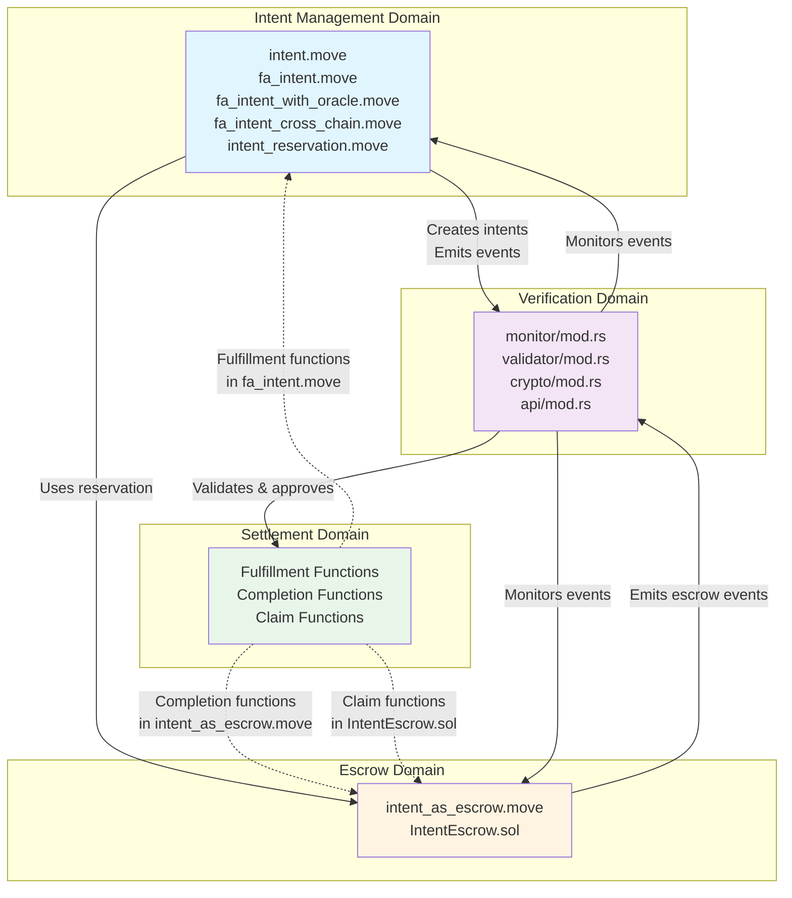

# Component-to-Domain Mapping Analysis

This document provides a comprehensive mapping of all source files in the Intent Framework to their respective domains. A domain is a logical grouping of related functionality that handles a specific set of responsibilities within the system. Domains organize the codebase into major functional areas with the following characteristics:

- Each domain has a clear purpose and responsibility
- Components (source files) belong to domains based on their functionality
- Domains interact with each other while maintaining clear boundaries
- This organization facilitates understanding of system interactions

This analysis forms the foundation for the architecture document.

## Domain Architecture Overview

## Domain Definitions

### 1. Intent Management Domain

**Responsibility**: Core intent creation, validation, and lifecycle management. Handles intent types, witness systems, reservation mechanisms, and event emissions.

**Key Characteristics**:

- Manages intent lifecycle (creation, expiry, revocation)
- Enforces type-safe witness validation
- Handles intent reservation for specific solvers
- Emits events for external monitoring

### 2. Escrow Domain

**Responsibility**: Asset custody and conditional release mechanisms on connected chains. Handles fund locking on individual chains, verifier integration, and escrow-specific security requirements. The cross-chain aspect comes from escrows being created on chains different from where intents are created (hub chain).

**Key Characteristics**:

- Locks assets awaiting verifier approval
- Enforces non-revocable requirement (CRITICAL security constraint)
- Supports both Move and EVM implementations
- Manages reserved solver addresses

### 3. Settlement Domain

**Responsibility**: Transaction completion and finalization processes across chains. Handles intent fulfillment, escrow release, and asset transfers.

**Note**: Unlike other domains, Settlement is not a separate module but rather represents completion/finalization functionality distributed across Intent Management and Escrow modules. This reflects the architectural pattern where settlement is the natural conclusion of intent/escrow operations.

**Key Characteristics**:

- Processes intent fulfillment by solvers
- Releases escrowed funds upon verifier approval
- Coordinates cross-chain asset transfers
- Handles expiry and cancellation scenarios

### 4. Verification Domain

**Responsibility**: Trusted verifier service that monitors chain events, validates cross-chain state, and provides cryptographic approvals for escrow releases.

**Key Characteristics**:

- Monitors events from multiple chains
- Validates cross-chain state consistency
- Generates cryptographic approval signatures
- Provides REST API for external integration

---

## Component Mapping

### Intent Management Domain

#### Core Intent Framework

- **`move-intent-framework/sources/intent.move`**
  - **Purpose**: Generic intent framework providing abstract structures and functions
  - **Key Structures**: `TradeIntent<Source, Args>`, `TradeSession<Args>`
  - **Key Functions**: `create_intent()`, `start_intent_session()`, `finish_intent_session()`, `revoke_intent()`
  - **Responsibilities**: Intent lifecycle, witness validation, expiry handling, revocation logic

#### Fungible Asset Intent Implementation

- **`move-intent-framework/sources/fa_intent.move`**
  - **Purpose**: Fungible asset trading intent implementation
  - **Key Structures**: `FungibleAssetLimitOrder`, `FungibleStoreManager`, `FungibleAssetRecipientWitness`
  - **Key Functions**: `create_fa_to_fa_intent()`, `fulfill_cross_chain_request_intent()`
  - **Key Events**: `LimitOrderEvent`, `LimitOrderFulfillmentEvent`
  - **Responsibilities**: FA-specific intent creation, fulfillment logic, event emission

#### Oracle-Guarded Intent Implementation

- **`move-intent-framework/sources/fa_intent_with_oracle.move`**
  - **Purpose**: Oracle signature requirement layer on top of base intent mechanics
  - **Key Structures**: `OracleGuardedLimitOrder`, `OracleSignatureRequirement`
  - **Key Functions**: `create_fa_to_fa_intent_with_oracle()`, `start_oracle_intent_session()`, `finish_oracle_intent_session()`
  - **Key Events**: `OracleLimitOrderEvent`
  - **Responsibilities**: Oracle signature verification, threshold validation

#### Cross-Chain Intent Creation

- **`move-intent-framework/sources/fa_intent_cross_chain.move`**
  - **Purpose**: Cross-chain request intent creation (tokens locked on different chain)
  - **Key Functions**: `create_cross_chain_request_intent()`, `create_cross_chain_request_intent_entry()`
  - **Responsibilities**: Creates unreserved intents with `intent_id` for cross-chain linking, zero-amount source (tokens on other chain)

#### Intent Reservation System

- **`move-intent-framework/sources/intent_reservation.move`**
  - **Purpose**: Reserved intent system for specific solver addresses
  - **Key Structures**: `IntentReserved`, `IntentToSign`, `IntentDraft`
  - **Key Functions**: `create_reserved_intent()`, `verify_solver_signature()`
  - **Responsibilities**: Solver reservation, signature verification for reserved intents

#### Test Utilities

- **`move-intent-framework/sources/test_fa_helper.move`**
  - **Purpose**: Test helper utilities for intent framework testing
  - **Domain**: Testing infrastructure (not part of production domains)

---

### Escrow Domain

#### Move-Based Escrow

- **`move-intent-framework/sources/intent_as_escrow.move`**
  - **Purpose**: Simplified escrow abstraction using oracle-intent system
  - **Key Structures**: `EscrowConfig`
  - **Key Functions**: `create_escrow()`, `start_escrow_session()`, `complete_escrow()`
  - **Security**: **CRITICAL** - Enforces non-revocable requirement (`revocable = false`)
  - **Responsibilities**: Escrow creation, session management, verifier approval handling

- **`move-intent-framework/sources/intent_as_escrow_entry.move`**
  - **Purpose**: Entry function wrappers for CLI convenience
  - **Key Functions**: `create_escrow_from_fa()`, `complete_escrow_from_fa()`
  - **Responsibilities**: User-friendly entry points for escrow operations

#### EVM-Based Escrow

- **`evm-intent-framework/contracts/IntentEscrow.sol`**
  - **Purpose**: Solidity escrow contract for EVM chains
  - **Key Structures**: `Escrow` struct
  - **Key Functions**: `createEscrow()`, `deposit()`, `claim()`, `cancel()`
  - **Key Events**: `EscrowInitialized`, `DepositMade`, `EscrowClaimed`, `EscrowCancelled`
  - **Security**: Enforces reserved solver addresses, expiry-based cancellation
  - **Responsibilities**: EVM escrow creation, fund locking, verifier signature verification, fund release

#### Mock Contracts (Testing)

- **`evm-intent-framework/contracts/MockERC20.sol`**
  - **Purpose**: Mock ERC20 token for testing
  - **Domain**: Testing infrastructure (not part of production domains)

---

### Settlement Domain

#### Intent Fulfillment (Move)

- **`move-intent-framework/sources/fa_intent.move`** (fulfillment functions)
  - **Key Functions**: `fulfill_cross_chain_request_intent()`, `finish_fa_intent_session()`
  - **Responsibilities**: Processes solver fulfillment, validates conditions, transfers assets

#### Escrow Completion (Move)

- **`move-intent-framework/sources/intent_as_escrow.move`** (completion functions)
  - **Key Functions**: `complete_escrow()`
  - **Responsibilities**: Verifies verifier approval, releases escrowed funds to solver

#### Escrow Claim (EVM)

- **`evm-intent-framework/contracts/IntentEscrow.sol`** (claim function)
  - **Key Functions**: `claim()`
  - **Responsibilities**: Verifies verifier signature, transfers funds to reserved solver

#### Escrow Cancellation

- **`evm-intent-framework/contracts/IntentEscrow.sol`** (cancel function)
  - **Key Functions**: `cancel()`
  - **Responsibilities**: Returns funds to maker after expiry

---

### Verification Domain

#### Event Monitoring

- **`trusted-verifier/src/monitor/mod.rs`**
  - **Purpose**: Monitors blockchain events from hub and connected chains
  - **Key Structures**: `IntentEvent`, `EscrowEvent`, `FulfillmentEvent`, `EventMonitor`
  - **Key Functions**: `poll_events()`, `get_cached_events()`, `match_events_by_intent_id()`
  - **Responsibilities**: Event polling, caching, cross-chain event correlation

#### Cross-Chain Validation

- **`trusted-verifier/src/validator/mod.rs`**
  - **Purpose**: Validates cross-chain state consistency and escrow safety
  - **Key Structures**: `ValidationResult`, `CrossChainValidator`
  - **Key Functions**: `validate_intent_safety()`, `validate_fulfillment()`, `validate_escrow_safety()`
  - **Security**: **CRITICAL** - Validates `revocable = false` requirement
  - **Responsibilities**: Intent safety checks, fulfillment validation, approval decision logic

#### Cryptographic Operations

- **`trusted-verifier/src/crypto/mod.rs`**
  - **Purpose**: Cryptographic operations for approval signatures
  - **Key Structures**: `ApprovalSignature`, `CryptoService`
  - **Key Functions**: `sign_approval()`, `verify_signature()`, `get_public_key()`
  - **Responsibilities**: Ed25519 (Aptos) and ECDSA (EVM) signature generation/verification

#### REST API Server

- **`trusted-verifier/src/api/mod.rs`**
  - **Purpose**: REST API for external system integration
  - **Key Endpoints**: `/health`, `/public-key`, `/events`, `/approvals`, `/approval`
  - **Key Structures**: `ApiServer`, `ApiResponse<T>`
  - **Responsibilities**: HTTP request handling, event/approval retrieval, manual approval creation

#### Configuration Management

- **`trusted-verifier/src/config/mod.rs`**
  - **Purpose**: Service configuration management
  - **Key Structures**: `Config`, `ChainConfig`, `EvmChainConfig`, `VerifierConfig`, `ApiConfig`
  - **Responsibilities**: Configuration loading, validation, chain-specific settings

#### Aptos Client

- **`trusted-verifier/src/aptos_client.rs`**
  - **Purpose**: Aptos blockchain client for event querying
  - **Key Functions**: `get_events()`, `get_limit_order_events()`, `get_escrow_events()`
  - **Responsibilities**: Blockchain RPC communication, event parsing

#### Core Library

- **`trusted-verifier/src/lib.rs`**
  - **Purpose**: Library root, re-exports common types
  - **Responsibilities**: Module organization, public API definition

#### Main Entry Point

- **`trusted-verifier/src/main.rs`**
  - **Purpose**: Application entry point
  - **Responsibilities**: Service initialization, event loop orchestration

#### Utility Binaries

- **`trusted-verifier/src/bin/generate_keys.rs`**
  - **Purpose**: Key pair generation utility
  - **Domain**: Development tooling

- **`trusted-verifier/src/bin/get_verifier_eth_address.rs`**
  - **Purpose**: Derive Ethereum address from Ed25519 key
  - **Domain**: Development tooling

---

## Cross-Domain Dependencies

### Intent Management → Escrow

- Escrow uses oracle-intent system (`fa_intent_with_oracle`) for implementation
- Escrow requires intent reservation system (`intent_reservation`) for solver addresses

### Escrow → Verification

- Escrow emits events (`OracleLimitOrderEvent`) monitored by verifier
- Escrow requires verifier public key for signature verification

### Settlement → Intent Management

- Settlement uses intent fulfillment functions from `fa_intent`
- Settlement validates witness types from `intent` module

### Settlement → Escrow

- Settlement completes escrows using `complete_escrow()` / `claim()`
- Settlement requires verifier approval signatures

### Verification → Intent Management

- Verifier monitors `LimitOrderEvent` and `LimitOrderFulfillmentEvent`
- Verifier validates intent safety requirements

### Verification → Escrow

- Verifier monitors `EscrowInitialized` / `OracleLimitOrderEvent`
- Verifier validates escrow non-revocability
- Verifier generates approval signatures for escrow release

---

## Domain Boundaries Summary

This table provides a concise overview of domain boundaries, listing the primary source files for each domain and their core responsibilities. It serves as a quick reference for understanding which components belong to which domain and what each domain's primary function is within the Intent Framework system.

| Domain | Primary Files | Key Responsibility |
|--------|--------------|-------------------|
| **Intent Management** | `intent.move`, `fa_intent.move`, `fa_intent_with_oracle.move`, `fa_intent_cross_chain.move`, `intent_reservation.move` | Intent lifecycle, creation, validation, event emission |
| **Escrow** | `intent_as_escrow.move`, `intent_as_escrow_entry.move`, `IntentEscrow.sol` | Asset custody, fund locking, verifier integration |
| **Settlement** | Functions in `fa_intent.move`, `intent_as_escrow.move`, `IntentEscrow.sol` | Intent fulfillment, escrow completion, asset transfers |
| **Verification** | `monitor/mod.rs`, `validator/mod.rs`, `crypto/mod.rs`, `api/mod.rs`, `config/mod.rs`, `aptos_client.rs` | Event monitoring, cross-chain validation, approval signatures |
