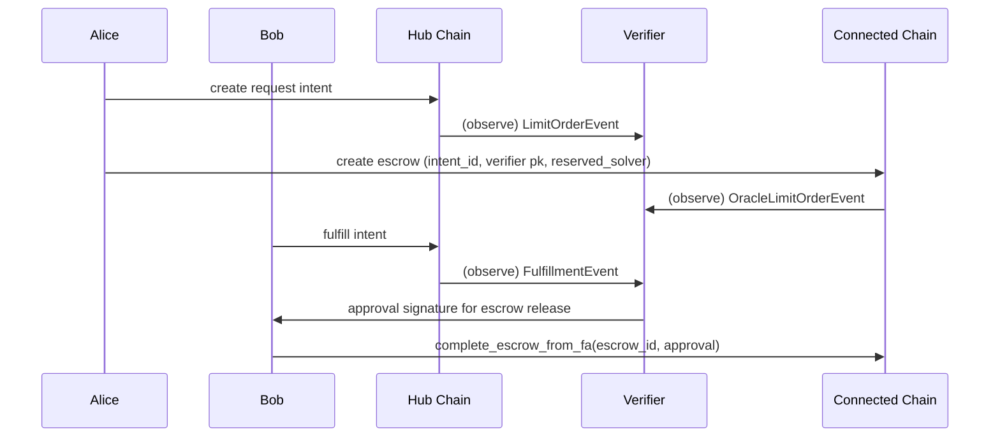

# Cross-Chain Flow

The intent framework enables cross-chain escrow operations where intents are created on a hub chain and escrows are created on connected chains. The verifier monitors both chains and provides approval signatures to authorize escrow release.

## Flow Steps

1. **Hub**: Alice creates regular (non-oracle) intent (emits `LimitOrderEvent`)
2. **Connected**: Alice creates escrow (non-revocable), includes verifier public key, links `intent_id`, and specifies reserved solver address (emits `OracleLimitOrderEvent`)
3. **Hub**: Bob fulfills the intent (emits `LimitOrderFulfillmentEvent`)
4. **Verifier**: observes fulfillment + escrow, generates approval signature (BCS(u64=1))
5. **Script**: submits `complete_escrow_from_fa` on connected chain with approval signature

**Note**: All escrows must specify a reserved solver address at creation. Funds are always transferred to the reserved solver when the escrow is claimed, regardless of who sends the transaction.

